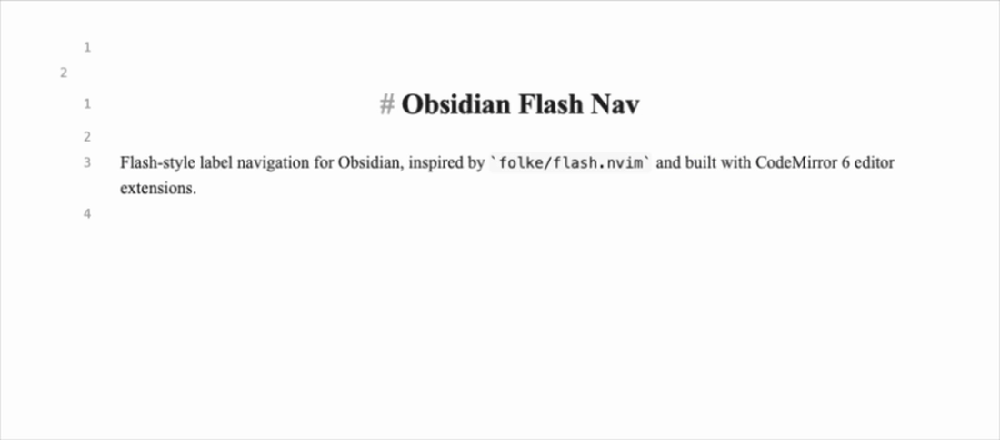

# Obsidian Flash Nav

Flash-style label navigation for the Obsidian editor, inspired by `folke/flash.nvim`.



Fast flow:

1. Trigger `Start jump` (or mapped `s` in Vim normal mode).
2. Type a search pattern.
3. Press the label character to jump.

## Features

- Start flash mode from command palette: `Start jump`
- Type a pattern, see label hints, press label to jump
- Controls: `Backspace` edit pattern, `Enter` jump current target, `Esc` cancel
- Vim-friendly workflow via Obsidian hotkeys or `.obsidian.vimrc`
- Configurable settings:
  - label alphabet
  - label reuse mode (none/lowercase/all)
  - label current match toggle
  - search direction (closest/forward/backward)
  - search scope (viewport/current line/document)
  - case sensitive and smart-case matching
  - auto-jump on single match
  - backdrop dim opacity

## Setup (Development)

Based on the official Obsidian build workflow:
https://docs.obsidian.md/Plugins/Getting+started/Build+a+plugin

1. Clone this repository.
2. Run `npm install`.
3. Run `npm run dev` (watch mode) or `npm run build`.
   - Run `npm run test` for matcher/labeler unit checks.
4. Copy this repo into your vault plugin folder:
   - `<Vault>/.obsidian/plugins/flash-navigator/`
5. In Obsidian, enable Community plugins and turn on `Flash Navigator`.

## Vim Mapping (`.obsidian.vimrc`)

If you use `obsidian-vimrc-support`, add this to your vault root `.obsidian.vimrc`:

```vim
" Optional: release default 's' behavior
nunmap s
vunmap s

" Alias Obsidian command id to a short ex command
exmap flash obcommand flash-navigator:flash-nav-start

" Map normal mode and visual mode s to flash
nmap s :flash<CR>
vmap s :flash<CR>
```

Notes:

- Command id is `flash-navigator:flash-nav-start`.
- `<CR>` is required for ex command mappings in recent codemirror-vim versions.
- Visual mode requires `vmap s :flash<CR>`; without it, Vim keeps default visual substitute behavior.
- `obcommand` is provided by `obsidian-vimrc-support` and may change; fallback is direct Obsidian hotkey binding.
- Run `:obcommand` to inspect available command ids.

## Project

- GitHub issues: https://github.com/iyioon/obsidian-flash-nav/issues
- GitHub milestones: https://github.com/iyioon/obsidian-flash-nav/milestones
- Release process: `docs/RELEASING.md`
- Automated releases on tag push: `.github/workflows/release.yml`

## Performance Profiling (Dev)

To enable compute profiling logs in the developer console:

```js
globalThis.__FLASH_NAV_PROFILE__ = true
```

Disable it with:

```js
globalThis.__FLASH_NAV_PROFILE__ = false
```

When enabled, slow refresh cycles (>= 8ms) are logged with pattern length, match count, scope, and direction.

## Contributing

When opening a PR:

1. Link the issue/milestone item.
2. Mention relevant Obsidian docs used for implementation decisions.
3. Include verification notes (mode tested, vault setup, expected behavior).

## References

- Obsidian build guide: https://docs.obsidian.md/Plugins/Getting+started/Build+a+plugin
- Editor extensions: https://docs.obsidian.md/Plugins/Editor/Editor+extensions
- View plugins: https://docs.obsidian.md/Plugins/Editor/View+plugins
- State fields: https://docs.obsidian.md/Plugins/Editor/State+fields
- Plugin guidelines: https://docs.obsidian.md/Plugins/Releasing/Plugin+guidelines
- Submit plugin: https://docs.obsidian.md/Plugins/Releasing/Submit+your+plugin
- flash.nvim: https://github.com/folke/flash.nvim
